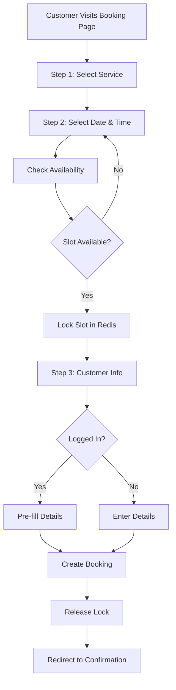

# Bookings

## Overview

The booking system enables customers to book services with providers through a 3-step public booking flow. Bookings can be made as guests or by logged-in customers, with automatic slot locking to prevent conflicts.

## User Stories

- As a **customer**, I want to book a service so that I can schedule an appointment
- As a **customer**, I want to see available time slots so that I can choose a convenient time
- As a **provider**, I want to manage bookings so that I can track appointments
- As a **provider**, I want to update booking status so that I can track completion

## Flow Diagram

## Implementation Details

### Server Actions
- **File**: `src/actions/bookings.ts`
- **Functions**:
  - `createBooking()` - Create new booking
  - `updateBookingStatus()` - Update booking status
  - `getAvailableSlots()` - Get available time slots

### Database Models
- **Booking** - Booking records
- **Service** - Services being booked
- **StaffMember** - Staff assigned to booking
- **Availability** - Staff availability schedules

### Key Components
- `src/components/booking/booking-flow.tsx` - Main booking flow component
- `src/components/booking/service-selector.tsx` - Service selection
- `src/components/booking/time-picker.tsx` - Date and time selection
- `src/components/booking/customer-form.tsx` - Customer information form
- `src/components/booking/booking-confirmation.tsx` - Confirmation page

### Redis Slot Locking
- **Purpose**: Prevent concurrent bookings for same slot
- **Key Format**: `booking:${providerId}:${date}:${time}`
- **TTL**: 5 minutes (configurable)
- **File**: `src/lib/redis.ts`

## User Interface

### Public Booking Route
- `/book/[providerId]` - Public booking page (no auth required)

### Booking Confirmation Route
- `/book/[providerId]/confirm` - Booking confirmation page

### Booking Flow Steps

#### Step 1: Service Selection
- **Component**: `ServiceSelector`
- **Displays**: List of active services
- **Shows**: Service name, description, duration, price
- **Action**: Select service and proceed

#### Step 2: Date & Time Selection
- **Component**: `TimePicker`
- **Displays**: Calendar with next 14 days
- **Shows**: Available time slots based on:
  - Staff availability
  - Existing bookings
  - Service duration
- **Action**: Select date and time slot

#### Step 3: Customer Information
- **Component**: `CustomerForm`
- **Fields**:
  - Full Name (required)
  - Phone Number (required)
  - Email (optional for guests)
  - Additional Notes (optional)
- **Logged-in Customers**: Name and email pre-filled
- **Action**: Submit booking

### Booking Status Management

#### Status Types
- **PENDING** - Initial status, awaiting confirmation
- **CONFIRMED** - Provider confirmed booking
- **COMPLETED** - Service completed
- **CANCELLED** - Booking cancelled
- **NO_SHOW** - Customer didn't show up

#### Status Updates
- Provider can update status from booking list
- Status changes trigger notifications (future)
- Completed bookings trigger payment processing

## Slot Availability

### Availability Calculation
1. Get staff availability for selected date
2. Get existing bookings for selected date
3. Calculate available slots based on:
   - Staff working hours
   - Service duration
   - Existing bookings
   - Time between bookings (buffer)

### Slot Locking
- **Purpose**: Prevent double-booking
- **Mechanism**: Redis lock with TTL
- **Lock Key**: `booking:${providerId}:${date}:${time}`
- **Duration**: 5 minutes (configurable via `SLOT_LOCK_TTL`)
- **Release**: Automatic on expiration or booking completion

## Edge Cases

### Concurrent Bookings
- **Problem**: Two customers book same slot simultaneously
- **Solution**: Redis lock prevents second booking
- **Error**: "This time slot is no longer available"

### Expired Lock
- **Problem**: Customer takes too long to complete booking
- **Behavior**: Lock expires, slot becomes available
- **Recovery**: Customer must select new time slot

### No Available Slots
- **Problem**: No slots available for selected date
- **Display**: "No available slots" message
- **Action**: Customer selects different date

### Invalid Service Selection
- **Problem**: Service becomes inactive during booking
- **Validation**: Check service status before booking creation
- **Error**: "Service is no longer available"

## Related Features

- [Customer Accounts](./customer-accounts.md) - Guest booking linking
- [Availability Management](./availability-management.md) - Staff schedules
- [Payments](./payments.md) - Payment processing
- [Redis Integration](../technical/redis-integration.md) - Slot locking

## Changelog

- **2025-01-10** - Initial bookings documentation
- **2025-01-10** - Added slot locking mechanism
- **2025-01-10** - Documented guest vs logged-in customer flow
