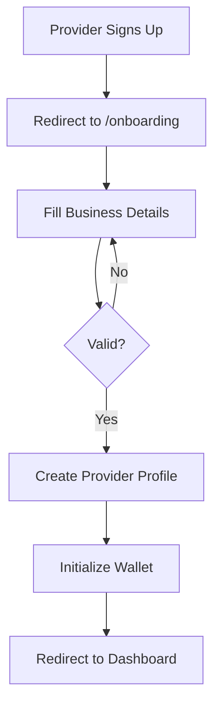

# Provider Onboarding

## Overview

After a provider signs up, they must complete onboarding to create their business profile. This includes collecting business details, initializing their wallet, and setting up their timezone.

## User Stories

- As a **new provider**, I want to set up my business profile so that I can start managing services and bookings
- As a **provider**, I want to configure my timezone so that availability and bookings are displayed correctly
- As a **provider**, I want my wallet initialized automatically so that I can track earnings

## Flow Diagram

## Implementation Details

### Server Action
- **File**: `src/actions/provider.ts`
- **Function**: `createProvider(data)`
- **Process**:
  1. Validates input with Zod schema
  2. Checks for existing provider profile
  3. Creates Provider record in transaction
  4. Creates Wallet record with balance 0
  5. Returns success or error

### Database Models
- **Provider** - Business profile
- **Wallet** - Earnings wallet (auto-created)

### Key Components
- `src/components/provider/onboarding-form.tsx` - Onboarding form
- `src/app/(provider)/onboarding/page.tsx` - Onboarding page

## User Interface

### Route
- `/onboarding` - Onboarding page (protected, redirects if already onboarded)

### Form Fields

#### Required Fields
- **Business Name** - Text input
- **Industry** - Searchable combobox (from `src/lib/constants.ts`)
- **Phone Number** - Text input
- **Business Email** - Email input
- **Timezone** - Select dropdown (from `src/lib/constants.ts`)

#### Optional Fields
- **Address** - Text input

### Validation
- Business name: Required, minimum 1 character
- Industry: Required, must be from predefined list
- Phone: Required, minimum 1 character
- Email: Required, valid email format
- Timezone: Required, defaults to "Africa/Lagos"

### Form Behavior
- Shows loading state during submission
- Displays toast notifications for success/error
- Redirects to `/dashboard` on success
- Prevents duplicate provider creation

## Edge Cases

### Duplicate Provider Profile
- **Error**: "Provider profile already exists"
- **Prevention**: Check for existing provider before creation
- **Resolution**: Redirect to dashboard if profile exists

### Missing Required Fields
- **Error**: Toast notification "Please fill in all required fields"
- **Validation**: Client-side and server-side validation

### Wallet Creation Failure
- **Behavior**: Transaction rolls back (Provider not created)
- **Error**: "Failed to create provider profile"
- **Recovery**: User can retry onboarding

## Related Features

- [Authentication](./authentication.md) - Provider signup
- [Dashboard](./dashboard.md) - Post-onboarding redirect
- [Settings](./settings.md) - Update business details
- [Wallet](./wallet.md) - Wallet initialization

## Changelog

- **2025-01-10** - Initial onboarding documentation
- **2025-01-10** - Added industry combobox and timezone select
