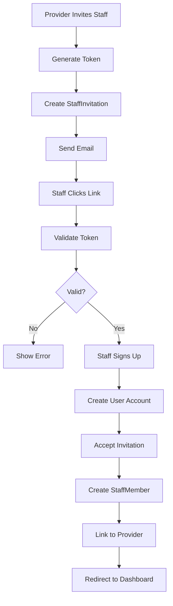

# Staff Management

## Overview

Providers can invite staff members to join their team. Staff members receive email invitations, sign up via invitation link, and are granted role-based access to the provider dashboard.

## User Stories

- As a **provider**, I want to invite staff members so that they can help manage bookings
- As a **provider**, I want to assign roles (OWNER/STAFF) so that I can control access levels
- As a **staff member**, I want to accept an invitation so that I can access the provider dashboard
- As a **staff member**, I want to understand my permissions so that I know what I can do

## Flow Diagram

## Implementation Details

### Server Actions
- **File**: `src/actions/staff-invitations.ts`
- **Functions**:
  - `sendStaffInvitation()` - Create and send invitation
  - `getInvitationByToken()` - Validate invitation token
  - `acceptInvitation()` - Accept invitation and create staff member
  - `acceptInvitationAfterSignup()` - Accept after user creation

### Database Models
- **StaffInvitation** - Invitation tokens and metadata
- **StaffMember** - Staff member records
- **User** - User accounts

### Key Components
- `src/components/provider/staff-form.tsx` - Invitation form
- `src/components/provider/staff-list.tsx` - Staff list display
- `src/components/auth/staff-signup-form.tsx` - Staff signup form
- `src/app/(auth)/signup/staff/page.tsx` - Staff signup page

### Email Integration
- **Service**: Resend
- **Template**: HTML email with invitation link
- **Configuration**: `src/lib/email.ts`

## User Interface

### Provider Routes
- `/staff` - Staff management page (providers and OWNER role only)

### Staff Signup Route
- `/signup/staff?token=...` - Staff signup page (requires valid token)

### Forms

#### Staff Invitation Form
- **Fields**: Email, Role (OWNER/STAFF), Service Assignments
- **Validation**:
  - Email must be valid
  - Cannot invite existing staff member
  - Cannot send duplicate pending invitations
- **Process**:
  1. Validates email and role
  2. Generates unique token
  3. Creates StaffInvitation (expires in 7 days)
  4. Sends email with invitation link
  5. Shows success/error toast

#### Staff Signup Form
- **Fields**: Name, Email (pre-filled), Password, Confirm Password
- **Validation**: Same as provider signup
- **Process**:
  1. Validates invitation token
  2. Creates user account
  3. Accepts invitation (creates StaffMember)
  4. Links to provider via `providerId`
  5. Redirects to `/dashboard`

## Staff Roles

### OWNER Role
- Full access like provider
- Can manage staff
- Can edit services
- Can view all bookings
- Can access wallet and settings

### STAFF Role
- Limited access
- Can view services (read-only)
- Can view own bookings only
- Can manage own availability
- Cannot access wallet, settings, or staff management

## Permission System

### Access Control
- **File**: `src/lib/staff-helpers.ts`
- **Functions**:
  - `getProviderAccess()` - Get provider context via staff membership
  - `canManageStaff()` - Check if can manage staff
  - `canEditServices()` - Check if can edit services
  - `canViewAllBookings()` - Check if can view all bookings

### Route Protection
- Provider layout checks staff access
- Staff members access provider routes via `staffMember.providerId`
- Permission checks filter data and UI elements

## Edge Cases

### Invalid/Expired Token
- **Error**: "Invalid or expired invitation"
- **Validation**: Checks token existence and expiration date
- **Resolution**: Provider must send new invitation

### Duplicate Invitation
- **Error**: "An invitation has already been sent to this email"
- **Prevention**: Check for pending invitations before creating new one

### Existing Staff Member
- **Error**: "This user is already a staff member"
- **Prevention**: Check for existing StaffMember record

### Email Sending Failure
- **Behavior**: Invitation still created in database
- **Logging**: Error logged to console
- **Recovery**: Provider can resend invitation

## Related Features

- [Authentication](./authentication.md) - Staff signup flow
- [Permissions](../technical/permissions.md) - Role-based access control
- [Dashboard](./dashboard.md) - Staff dashboard access
- [Email Integration](../technical/email-integration.md) - Invitation emails

## Changelog

- **2025-01-10** - Initial staff management documentation
- **2025-01-10** - Added hybrid staff access pattern
- **2025-01-10** - Documented role-based permissions
