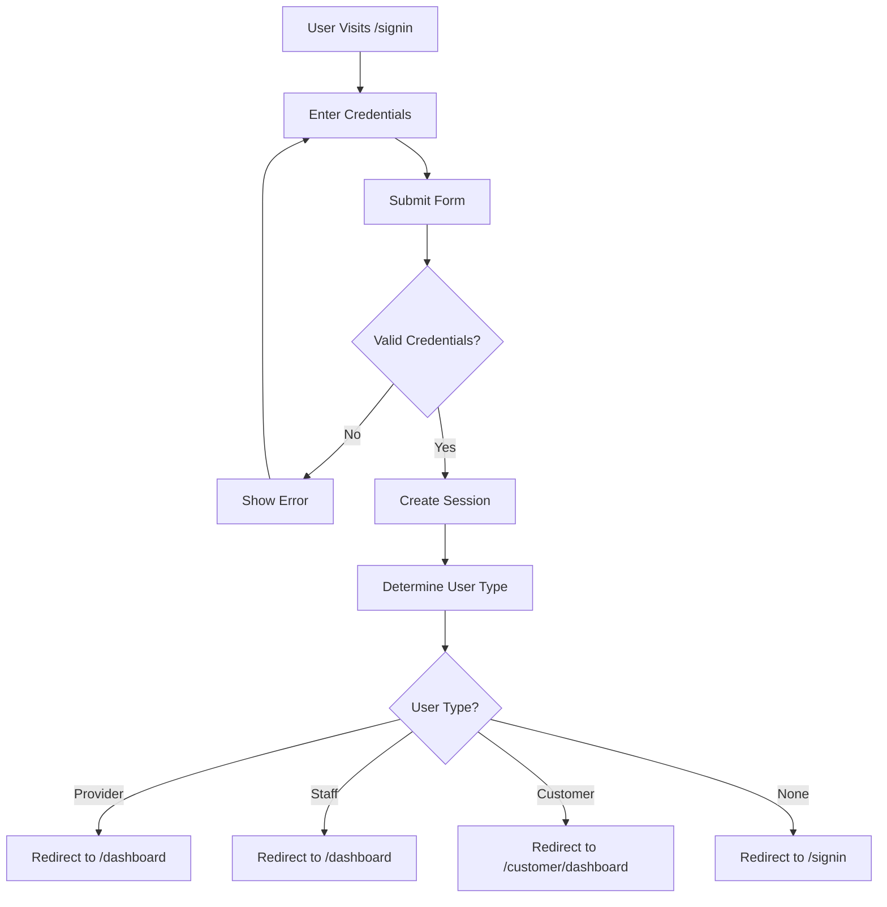

# Authentication Flow

## Overview

Complete flow of user signin, role detection, and role-based redirects.

## Flow Diagram



## Step-by-Step Flow

### Step 1: User Visits Signin Page

1. User navigates to `/signin`
2. If already signed in:
   - System determines user type
   - Redirects to appropriate dashboard
3. User views signin form

### Step 2: User Enters Credentials

1. User enters:
   - Email address
   - Password
2. Optional query parameters:
   - `email` - Pre-fills email field
   - `invitationToken` - For staff invitations

### Step 3: Authentication

1. User submits form
2. System authenticates with Better Auth:
   - Validates credentials
   - Creates session
   - Returns session token
3. If invalid:
   - Shows error message
   - User can retry

### Step 4: Role Detection

1. System calls `getUserType(session)`:
   - Checks for Provider record
   - If found → `'provider'`
   - Else checks for StaffMember record
   - If found → `'staff'`
   - Else → `'customer'`

### Step 5: Redirect

1. System calls `getRedirectPath(userType)`:
   - `'provider'` → `/dashboard`
   - `'staff'` → `/dashboard` (provider dashboard)
   - `'customer'` → `/customer/dashboard`
   - `null` → `/signin`
2. User redirected to appropriate dashboard

## Role Detection Logic

### Provider Detection
```typescript
const provider = await prisma.provider.findUnique({
  where: { userId: session.user.id }
})
if (provider) return 'provider'
```

### Staff Detection
```typescript
const staffMember = await prisma.staffMember.findFirst({
  where: { userId: session.user.id }
})
if (staffMember) return 'staff'
```

### Customer Detection
- Default if not provider or staff
- No explicit check needed

## Edge Cases

### Invalid Credentials
- **Error**: "Invalid email or password"
- **Action**: User can retry or reset password

### Expired Session
- **Detection**: Session expiration checked on each request
- **Action**: Automatic redirect to `/signin`

### Multiple Roles
- **Scenario**: User is both provider and staff (shouldn't happen)
- **Resolution**: Provider role takes precedence
- **Logic**: Provider check happens first

### Staff Invitation Token
- **Parameter**: `invitationToken` in URL
- **Behavior**: Token validated after signin
- **Action**: If valid, redirects to staff signup

## Related Documentation

- [Authentication Feature](../features/authentication.md) - Feature details
- [Staff Management](../features/staff-management.md) - Staff access
- [Permissions](../technical/permissions.md) - Access control

## Changelog

- **2025-01-10** - Initial authentication flow documentation
