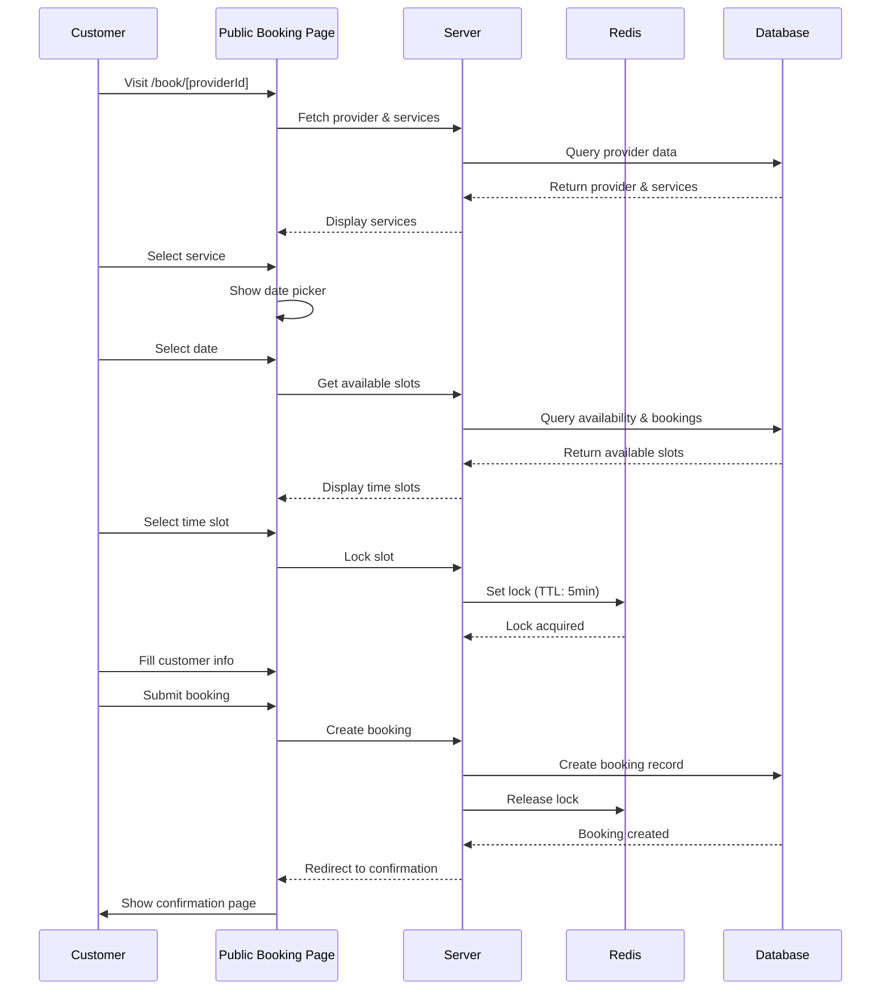

# Booking Flow

## Overview

Complete step-by-step flow of the customer booking process from service selection to confirmation.

## Flow Diagram

## Step-by-Step Flow

### Step 1: Service Selection

1. Customer visits `/book/[providerId]`
2. System fetches:
   - Provider information
   - Active services
   - Active staff members
3. Customer views service list
4. Customer selects a service
5. System stores selected service in state

### Step 2: Date & Time Selection

1. Customer views calendar (next 14 days)
2. Customer selects a date
3. System calculates available slots:
   - Get staff availability for selected date
   - Get existing bookings for selected date
   - Calculate available time slots based on:
     - Service duration
     - Staff working hours
     - Existing bookings
     - Time buffers
4. Customer views available time slots
5. Customer selects a time slot
6. System attempts to lock slot in Redis

### Step 3: Customer Information

1. Customer views booking summary:
   - Service name
   - Date and time
   - Duration
   - Price
2. If logged in:
   - Name and email pre-filled
   - Customer can edit if needed
3. If guest:
   - Customer enters:
     - Full Name (required)
     - Phone Number (required)
     - Email (optional)
     - Additional Notes (optional)
4. Customer submits booking
5. System creates booking:
   - Validates slot still available
   - Creates Booking record
   - Releases Redis lock
   - Links to customer account if logged in
6. System redirects to confirmation page

### Step 4: Confirmation

1. Customer views confirmation page
2. Displays:
   - Booking reference
   - Service details
   - Date and time
   - Staff member
   - Customer information
   - Status (PENDING)

## Error Handling

### Slot No Longer Available
- **Cause**: Another customer booked the slot
- **Error**: "This time slot is no longer available"
- **Action**: Customer selects new time slot

### Lock Expiration
- **Cause**: Customer took too long (>5 minutes)
- **Behavior**: Lock expires, slot becomes available
- **Action**: Customer must select new time slot

### Invalid Service
- **Cause**: Service deactivated during booking
- **Error**: "Service is no longer available"
- **Action**: Customer selects different service

## Edge Cases

### Concurrent Bookings
- Two customers select same slot simultaneously
- Redis lock prevents double-booking
- First booking succeeds, second fails with error

### Guest vs Logged-in Customer
- Guest bookings: No `userId`, email optional
- Logged-in: `userId` linked, email pre-filled
- Guest bookings can be linked later via email matching

## Related Documentation

- [Bookings Feature](../features/bookings.md) - Feature details
- [Redis Integration](../technical/redis-integration.md) - Slot locking
- [Customer Accounts](../features/customer-accounts.md) - Guest booking linking

## Changelog

- **2025-01-10** - Initial booking flow documentation
