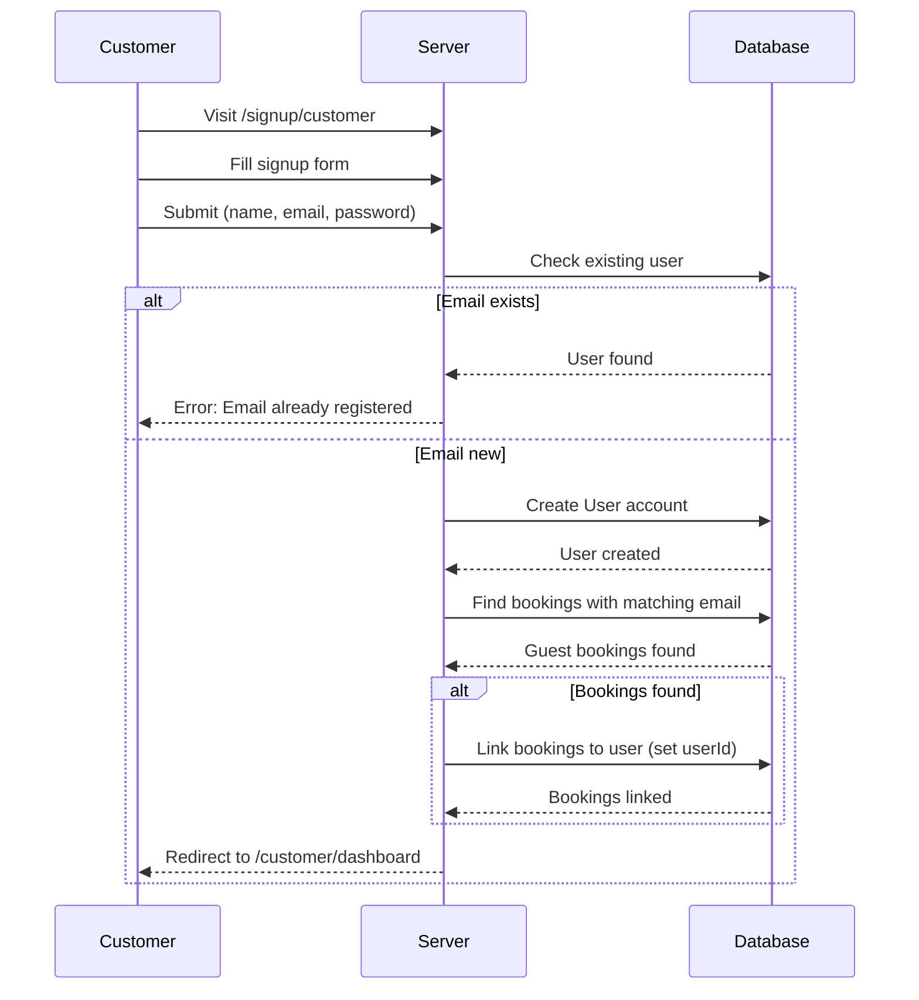

# Customer Signup Flow

## Overview

Complete flow of customer account creation and guest booking linking.

## Flow Diagram

## Step-by-Step Flow

### Step 1: Customer Visits Signup Page

1. Customer navigates to `/signup/customer`
2. Customer views signup form
3. If already signed in, redirects to `/customer/dashboard`

### Step 2: Customer Fills Form

1. Customer enters:
   - Full Name
   - Email Address
   - Password (minimum 8 characters)
   - Confirm Password
2. System validates:
   - All fields required
   - Email format valid
   - Password minimum length
   - Passwords match
   - Email not already registered

### Step 3: Account Creation

1. System creates User account
2. System searches for guest bookings:
   - Query bookings with matching email
   - Filter bookings without `userId`
3. System links bookings:
   - Update `userId` field on matching bookings
   - Bookings now appear in customer dashboard

### Step 4: Redirect to Dashboard

1. System redirects to `/customer/dashboard`
2. Customer sees:
   - Booking statistics
   - Linked guest bookings (if any)
   - Upcoming bookings
   - Past bookings

## Guest Booking Linking

### Matching Criteria
- Email must match exactly (case-insensitive)
- Booking must not have `userId` (guest booking)
- Booking can be any status

### Linking Process
1. After user creation, query bookings
2. Filter by email match and null `userId`
3. Update all matching bookings with new `userId`
4. Bookings immediately available in dashboard

## Error Handling

### Duplicate Email
- **Error**: "Email already registered"
- **Toast**: Error notification shown
- **Action**: Customer can sign in instead

### Validation Errors
- **Errors**: Field-specific validation messages
- **Display**: Inline errors and toast notifications

## Edge Cases

### No Guest Bookings
- **Behavior**: Account created normally
- **Display**: Empty booking history
- **Action**: Customer can make new bookings

### Multiple Guest Bookings
- **Behavior**: All matching bookings linked
- **Display**: All appear in booking history
- **Order**: Sorted by date (newest first)

### Email Case Sensitivity
- **Matching**: Case-insensitive email comparison
- **Example**: "John@Example.com" matches "john@example.com"

## Related Documentation

- [Customer Accounts](../features/customer-accounts.md) - Feature details
- [Authentication](../features/authentication.md) - Signup process
- [Bookings](../features/bookings.md) - Guest bookings

## Changelog

- **2025-01-10** - Initial customer signup flow documentation
