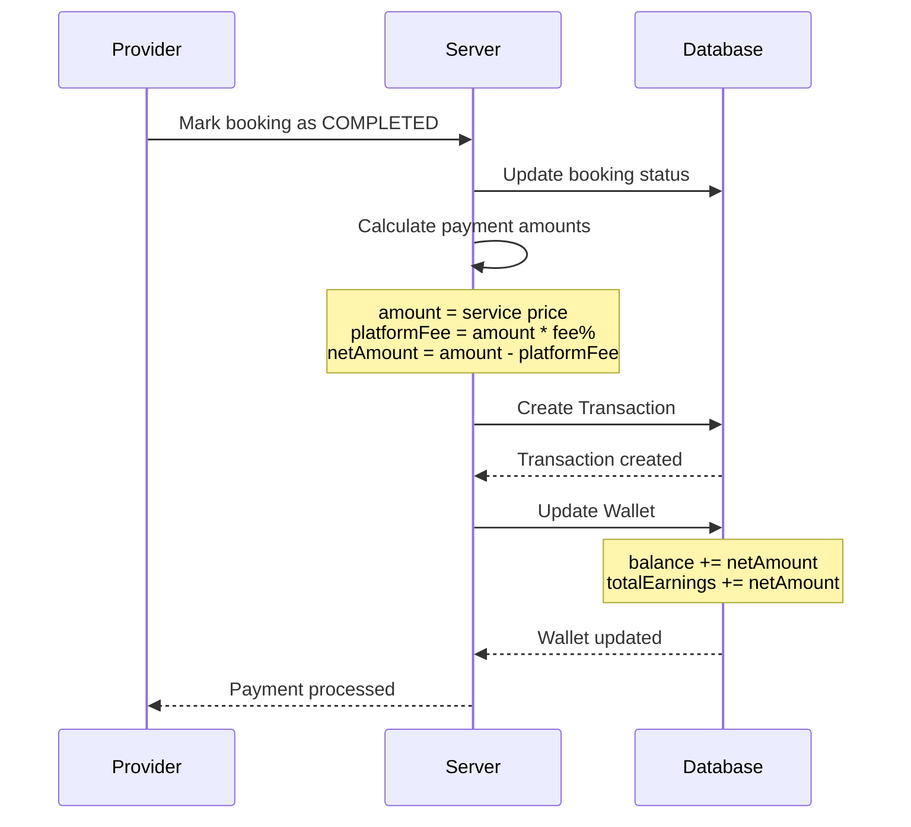

# Payment Flow

## Overview

Complete flow of payment processing for completed bookings, including transaction creation and wallet updates.

## Flow Diagram

## Step-by-Step Flow

### Step 1: Booking Completion

1. Provider marks booking as COMPLETED
2. System updates booking status
3. System triggers payment processing

### Step 2: Payment Calculation

1. System retrieves service price
2. System calculates:
   - **Amount**: Service price
   - **Platform Fee**: `amount * (PLATFORM_FEE_PERCENTAGE / 100)`
   - **Net Amount**: `amount - platformFee`
3. Default platform fee: 10% (configurable)

### Step 3: Transaction Creation

1. System creates Transaction record:
   - Booking ID (unique)
   - Amount
   - Platform fee
   - Net amount
   - Payment provider (SIMULATED in MVP)
   - Status (PENDING initially)
2. Transaction linked to booking

### Step 4: Wallet Update

1. System retrieves provider wallet
2. System updates wallet:
   - **Balance**: Increased by net amount
   - **Total Earnings**: Increased by net amount
3. Transaction status updated to PAID

### Step 5: Completion

1. Payment processing complete
2. Provider can view:
   - Updated wallet balance
   - Transaction in history
   - Updated total earnings

## Error Handling

### Payment Processing Failure
- **Status**: Transaction status set to FAILED
- **Behavior**: Wallet not updated
- **Recovery**: Retry payment processing

### Missing Wallet
- **Validation**: Check wallet exists
- **Error**: "Wallet not found"
- **Recovery**: Initialize wallet (should not happen)

## Edge Cases

### Zero Platform Fee
- **Configuration**: `PLATFORM_FEE_PERCENTAGE = 0`
- **Result**: `netAmount = amount`
- **Use Case**: Testing or special arrangements

### Decimal Precision
- **Storage**: Decimal(10, 2) in database
- **Calculation**: Maintains precision
- **Display**: Rounded to 2 decimal places

## Related Documentation

- [Payments Feature](../features/payments.md) - Feature details
- [Wallet Feature](../features/wallet.md) - Wallet management
- [Bookings Feature](../features/bookings.md) - Booking completion

## Changelog

- **2025-01-10** - Initial payment flow documentation
