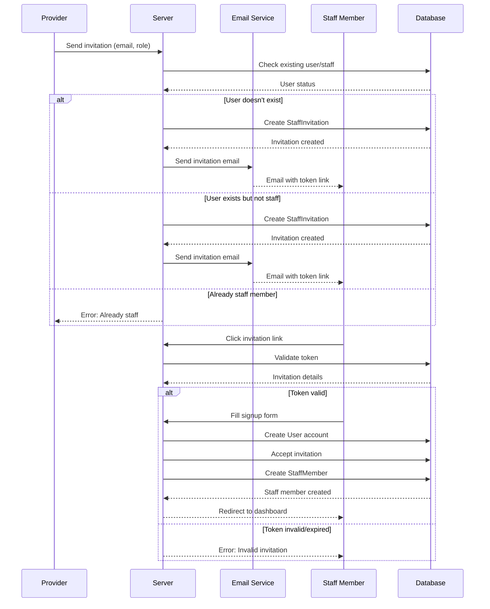

# Staff Invitation Flow

## Overview

Complete flow of inviting staff members, sending invitations, and staff acceptance process.

## Flow Diagram

## Step-by-Step Flow

### Step 1: Provider Sends Invitation

1. Provider navigates to `/staff`
2. Provider fills invitation form:
   - Email address
   - Role (OWNER or STAFF)
   - Service assignments (optional)
3. Provider submits form
4. System validates:
   - Email format
   - User not already staff member
   - No pending invitation for email
5. System generates unique token
6. System creates StaffInvitation record:
   - Token
   - Email
   - Role
   - Expiration (7 days)
   - Provider ID
7. System sends invitation email via Resend
8. Provider sees success message

### Step 2: Staff Receives Email

1. Staff member receives email
2. Email contains:
   - Business name
   - Role (OWNER or STAFF)
   - Invitation link with token
   - Expiration notice (7 days)
3. Staff clicks invitation link

### Step 3: Staff Views Signup Page

1. System validates token:
   - Checks token exists
   - Checks not expired
   - Checks not already accepted
2. If valid:
   - Shows signup form
   - Pre-fills email
   - Shows business name and role
3. If invalid:
   - Shows error message
   - Redirects to signin

### Step 4: Staff Completes Signup

1. Staff fills signup form:
   - Name
   - Email (pre-filled, editable)
   - Password
   - Confirm Password
2. Staff submits form
3. System creates User account
4. System accepts invitation:
   - Creates StaffMember record
   - Links to provider via `providerId`
   - Sets role from invitation
   - Marks invitation as accepted
   - Assigns services if specified
5. System redirects to `/dashboard`

## Error Handling

### Invalid Token
- **Error**: "Invalid or expired invitation"
- **Action**: Provider must send new invitation

### Expired Invitation
- **Validation**: Checks `expiresAt` date
- **Error**: "Invitation has expired"
- **Action**: Provider must send new invitation

### Already Accepted
- **Validation**: Checks `acceptedAt` field
- **Error**: "Invitation already accepted"
- **Action**: Staff can sign in normally

### Duplicate Staff Member
- **Error**: "This user is already a staff member"
- **Prevention**: Check before creating invitation

### Email Sending Failure
- **Behavior**: Invitation still created
- **Logging**: Error logged
- **Recovery**: Provider can resend invitation

## Edge Cases

### Existing User Signup
- User already has account with invitation email
- System creates StaffMember record
- Links to existing User account
- User can sign in normally

### Multiple Invitations
- Provider sends multiple invitations to same email
- Only one pending invitation allowed
- Error: "An invitation has already been sent"

## Related Documentation

- [Staff Management](../features/staff-management.md) - Feature details
- [Authentication](../features/authentication.md) - Staff signup
- [Email Integration](../technical/email-integration.md) - Email sending

## Changelog

- **2025-01-10** - Initial staff invitation flow documentation
